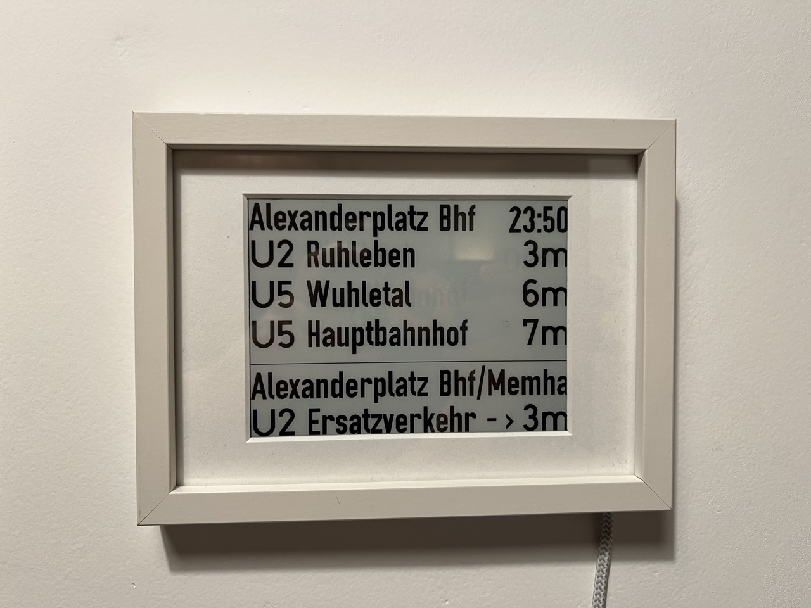
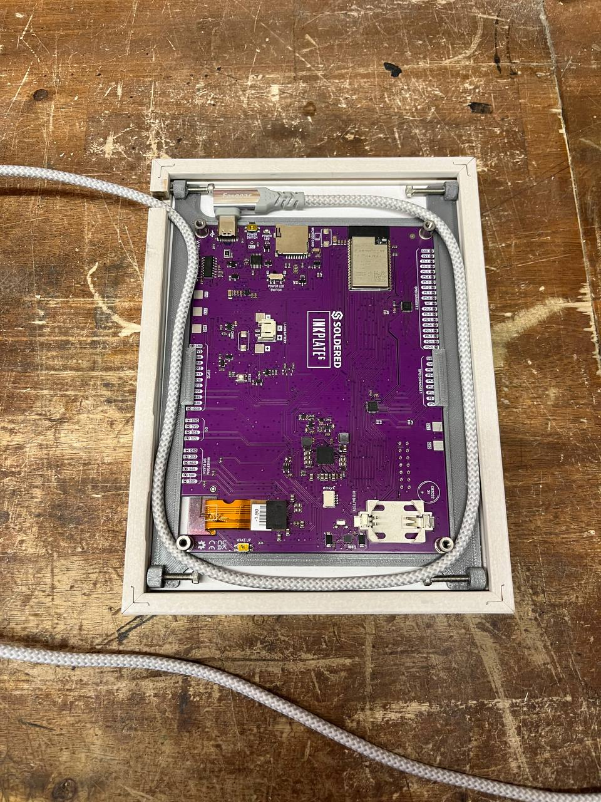

# eInk BVG Display



Displays upcoming BVG departures for selected lines and directions,
using https://v6.bvg.transport.rest/ API.

## Hardware

### Required parts

You can assemble this from off-the-shelf parts, except for the mounting adapter
that needs to be 3D printed. 

Linked online store links to the parts that are specific to this design (not sponsored lmao)

- [Inkplate 6 from Soldered Electronics](https://soldered.com/product/soldered-inkplate-6-6-e-paper-board/)
- [13x18 cm photo frame "Käthe" from modulor](https://www.modulor.de/en/kathe-interchangeable-picture-frame-wood-13-x-18-cm-basswood-white-st.html) 
or other that has a gap ~3 mm above the glass back surface that fits the retaining screws 
- passepartout 13x18 (90x122 cutout) ~1.5 mm thick - I got mine also from modulor, but any material or color should do
- 4x brass heat-set inserts for M3 screws 
- 4x M3 screws, long :) I used something >20 mm (TODO)
- 90-degree USB-C cable (2.0 is enough)
- printed [PCB holder](hardware/Inkplate%206%20PCB%20Holder%20130x180%20mm%20Photo%20Frame%20v1.stl)

### Tools

- (access to) a 3D printer that'll fit at least a 130x180 mm print
- soldering iron to put in the inserts
- a Dremel or router to cut a hole for the cable
- M3 hex bit/key

### Assembly

Cut a hole for the USB cable in the frame with a Dremel or router.
Depth and location depend on the cable and plug size.

Print the [PCB holder](hardware/Inkplate%206%20PCB%20Holder%20130x180%20mm%20Photo%20Frame%20v1.stl).

Put in the M3 brass inserts with a soldering iron.

Insert passe-partout into the frame.

Place Inkplate 6 PCB with display inside the PCB holder. 
The top surface of the PCB should be flush with the wall around it,
be careful with the buttons!

Place the assembled PCB in holder on top of passe-partout.

Screw in the M3 screws so that the holder stays put in the frame. 
Do not overtighten, in case you need to reposition the holder.

Insert the USB-C plug and route the cable.



## Software

### Prerequisites
- [micropython](https://micropython.org/) installed (either in venv or system-wide)
- [just](https://just.systems)
- [OSP-DIN font](http://osp.kitchen/foundry/osp-din/)
- [DIN1451-H font](http://www.peter-wiegel.de/Din1451-H.html)

### First time setup

Plug in the device. 

Download and install the dependencies:
```
just install-deps
```

Generate the font modules and copy them to the device:

```
just make-fonts copy-fonts
```

### Configure the stops 

```
cp config.example.json config.json
```

Open the `config.json`, configure your `"wifi"` and add the stations/directions 
you want to see on the display.

For `stops` IDs, get them from the API by using the search endpoint, for example:
https://v6.bvg.transport.rest/stops?query=Alexanderplatz

```json
[
	{
		"type": "station",
		"id": "de:11000:900100003",
		"name": "S+U Alexanderplatz",
		"location": {
			"type": "location",
			"latitude": 52.521512,
			"longitude": 13.411267
		},
		"weight": 44878.25,
		"relevance": 3.2829318915498114,
		"score": 116.66497993721558
	},
```

Due to some peculiarities of the API, the relevant ID is just the last part
after the `:` colon, so with the above result, you want to use `900100003`. 

_TODO: add search functionality._

`remove_phrases` is a list of text fragments that will always be ommitted 
from displayed destination names. 

`lines_directions` is a list of objects with fields:
- `line_name` - exact name of the line you want to see like `M10`, `27`, `U8`, `S42`... - you can have multiple rules for the same line;
- `direction_regex` - show departures towards directions that match this regex (use `.*` for all directions);
- `except_regex` - (optional) hide departures with directions matching this regex (say, if you never wanna go to `${BAD_SIDE_OF_THE_TOWN}`)

### Copy the main code and config

```
just install
```

_If you want to hack on the firmware, you'll have to repeat 
these steps every time you want to update the main code._

### Restart and watch the ~~blinkenlights~~ eInk refresh

```
just restart
```

The display should clear and you should start seeing logs:
```
 % just restart
mpremote reset
+ mpremote reset
mpremote exec "from soldered_inkplate6 import Inkplate; display = Inkplate(Inkplate.INKPLATE_1BIT); display.begin(); display.display()"
+ mpremote exec 'from soldered_inkplate6 import Inkplate; display = Inkplate(Inkplate.INKPLATE_1BIT); display.begin(); display.display()'
Mono: clean 851ms (17ms ea), draw 301ms (50ms ea), total 1152ms
mpremote exec --no-follow "import ui; ui.main()"
+ mpremote exec --no-follow 'import ui; ui.main()'
mpremote
+ mpremote
Connected to MicroPython at /dev/cu.usbserial-210
Use Ctrl-] or Ctrl-x to exit this shell
detected line height: 97
detected line height: 91
Connecting to WiFi 'spoko'
connecting to network...
...
```

In a few seconds you should see the display refresh with a clock 
and upcoming departures of the configured lines and stations.